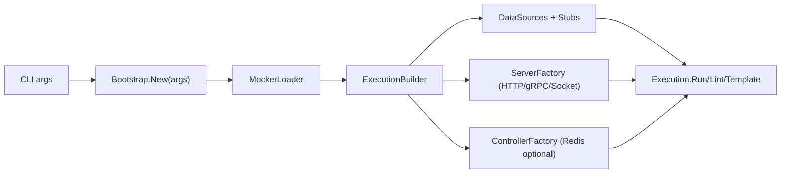

# QaaS.Mocker

[](https://github.com/TheSmokeTeam/QaaS.Mocker/actions/workflows/ci.yml)
[](https://dotnet.microsoft.com/)
[](https://thesmoketeam.github.io/qaas-docs/)

QaaS.Mocker is a configurable, protocol-aware mock server runtime for QaaS workloads. It lets you model behavior through YAML or code, route requests to transaction stubs, and optionally control runtime behavior through a Redis-backed controller API.

Official docs: [thesmoketeam.github.io/qaas-docs](https://thesmoketeam.github.io/qaas-docs/)

## Table of Contents

- [Packages](#packages)
- [Coverage](#coverage)
- [Capabilities](#capabilities)
- [Architecture](#architecture)
- [Quick Start](#quick-start)
- [Configuration and CLI](#configuration-and-cli)
- [Project Structure](#project-structure)
- [CI and Release](#ci-and-release)

## Packages

This repository has one solution (`QaaS.Mocker.sln`) and one solution-level README.

| Package | Purpose | Latest | Downloads |
| --- | --- | --- | --- |
| [`QaaS.Mocker`](https://www.nuget.org/packages/QaaS.Mocker/) | Main runtime package (bootstrap, loader, execution orchestration). | [](https://www.nuget.org/packages/QaaS.Mocker/) | [](https://www.nuget.org/packages/QaaS.Mocker/) |
| [`QaaS.Mocker.Controller`](https://www.nuget.org/packages?q=QaaS.Mocker.Controller) | Redis-based controller handlers (ping and runtime commands). | [](https://www.nuget.org/packages?q=QaaS.Mocker.Controller) | [](https://www.nuget.org/packages?q=QaaS.Mocker.Controller) |
| [`QaaS.Mocker.Servers`](https://www.nuget.org/packages?q=QaaS.Mocker.Servers) | HTTP/gRPC/socket server implementations and state/caching. | [](https://www.nuget.org/packages?q=QaaS.Mocker.Servers) | [](https://www.nuget.org/packages?q=QaaS.Mocker.Servers) |
| [`QaaS.Mocker.Stubs`](https://www.nuget.org/packages?q=QaaS.Mocker.Stubs) | Stub configuration/building and transaction execution. | [](https://www.nuget.org/packages?q=QaaS.Mocker.Stubs) | [](https://www.nuget.org/packages?q=QaaS.Mocker.Stubs) |

## Coverage

Coverage snapshot collected on `2026-03-06` via:

```bash
dotnet test QaaS.Mocker.sln -c Release --collect:"XPlat Code Coverage"
```

| Project | Coverage | Test projects |
| --- | --- | --- |
| `QaaS.Mocker` |  | `QaaS.Mocker.Tests` |
| `QaaS.Mocker.Controller` |  | `QaaS.Mocker.Controller.Tests`, `QaaS.Mocker.Tests` |
| `QaaS.Mocker.Servers` |  | `QaaS.Mocker.Servers.Tests`, `QaaS.Mocker.Tests` |
| `QaaS.Mocker.Stubs` |  | `QaaS.Mocker.Stubs.Tests`, `QaaS.Mocker.Tests` |

Overall line coverage across the four runtime projects: 

## Capabilities

- Protocol support:
  - HTTP / HTTPS
  - gRPC / gRPCs
  - Socket
- Execution modes:
  - `Run` to host the configured server(s)
  - `Lint` to validate configuration
  - `Template` to generate template output
- Configuration layering:
  - Base YAML configuration file
  - Zero or more overwrite files
  - Zero or more overwrite arguments (`Path:To:Setting=Value`)
  - Optional environment variable override resolution
- Stub orchestration:
  - Stub-to-action mapping
  - Processor hook resolution through loaded assemblies
  - Data source attachment per transaction stub
- Optional controller API over Redis:
  - Command handling (`ChangeActionStub`, `TriggerAction`, `Consume`)
  - Ping handling
  - Cached input/output consume pipeline

## Architecture



Runtime flow in `Run` mode:

1. Build context from YAML and overwrite sources.
2. Validate and construct data sources, stubs, server, and optional controller.
3. Route incoming actions/RPC calls/messages into transaction stubs.
4. Optionally consume cached input/output through Redis controller commands.

## Quick Start

Prerequisites:

- .NET SDK `10.0.x`
- Optional: Docker Desktop
- Optional for TLS examples: `dotnet dev-certs`

Build and test:

```bash
dotnet restore QaaS.Mocker.sln
dotnet build QaaS.Mocker.sln -c Release -warnaserror
dotnet test QaaS.Mocker.sln -c Release --no-build
```

Run HTTP example:

```bash
dotnet dev-certs https -ep QaaS.Mocker.Example/Certificates/devcert.pfx -p qaas-dev-cert
dotnet dev-certs https --trust
dotnet run --project QaaS.Mocker.Example -- mocker.qaas.yaml
```

Run gRPC example:

```bash
dotnet run --project QaaS.Mocker.Example -- mocker.grpc.qaas.yaml
```

## Configuration and CLI

Minimal HTTP config example:

```yaml
DataSources: []

Stubs:
  - Name: ExampleStub
    Processor: ExampleProcessor

Server:
  Type: Http
  Http:
    Port: 8443
    IsLocalhost: true
    IsSecuredSchema: true
    CertificatePath: Certificates/devcert.pfx
    CertificatePassword: qaas-dev-cert
    Endpoints:
      - Path: /health
        Actions:
          - Name: HealthAction
            Method: Get
            TransactionStubName: ExampleStub
```

CLI usage:

```bash
dotnet run --project QaaS.Mocker.Example -- <configuration-file> [options]
```

Common options:

- `-m|--mode` `Run|Lint|Template`
- `-w|--overwrite-files` `file1.yaml file2.yaml`
- `-r|--overwrite-arguments` `Path:To:Setting=Value`
- `--no-env`
- `-o|--output-folder <path>`
- `--run-locally`

## Project Structure

| Path | Description |
| --- | --- |
| [`QaaS.Mocker`](https://github.com/TheSmokeTeam/QaaS.Mocker/tree/master/QaaS.Mocker) | Bootstrap, options parsing, context loader, execution orchestration. |
| [`QaaS.Mocker.Servers`](https://github.com/TheSmokeTeam/QaaS.Mocker/tree/master/QaaS.Mocker.Servers) | Server implementations, state routing, endpoint/action matching, caching. |
| [`QaaS.Mocker.Stubs`](https://github.com/TheSmokeTeam/QaaS.Mocker/tree/master/QaaS.Mocker.Stubs) | Stub builder/configuration and processor execution pipeline. |
| [`QaaS.Mocker.Controller`](https://github.com/TheSmokeTeam/QaaS.Mocker/tree/master/QaaS.Mocker.Controller) | Redis controller initialization and runtime command/ping handlers. |
| [`QaaS.Mocker.Example`](https://github.com/TheSmokeTeam/QaaS.Mocker/tree/master/QaaS.Mocker.Example) | Runnable examples, proto files, sample processors, sample YAML files. |
| [`QaaS.Mocker.Tests`](https://github.com/TheSmokeTeam/QaaS.Mocker/tree/master/QaaS.Mocker.Tests) | End-to-end/unit tests for main orchestration logic. |
| [`QaaS.Mocker.Servers.Tests`](https://github.com/TheSmokeTeam/QaaS.Mocker/tree/master/QaaS.Mocker.Servers.Tests) | Unit tests for server behavior and server state routing. |
| [`QaaS.Mocker.Stubs.Tests`](https://github.com/TheSmokeTeam/QaaS.Mocker/tree/master/QaaS.Mocker.Stubs.Tests) | Unit tests for stub factory/builder/runtime behavior. |
| [`QaaS.Mocker.Controller.Tests`](https://github.com/TheSmokeTeam/QaaS.Mocker/tree/master/QaaS.Mocker.Controller.Tests) | Unit tests for controller and command handling behavior. |

## CI and Release

CI workflow: [`/.github/workflows/ci.yml`](https://github.com/TheSmokeTeam/QaaS.Mocker/blob/master/.github/workflows/ci.yml)

- Restores, builds with warnings as errors, and runs tests on each push/PR.
- Uses concurrency cancellation for duplicate branch runs.
- On tag builds, validates SemVer, packs `QaaS.Mocker`, and pushes to NuGet.
